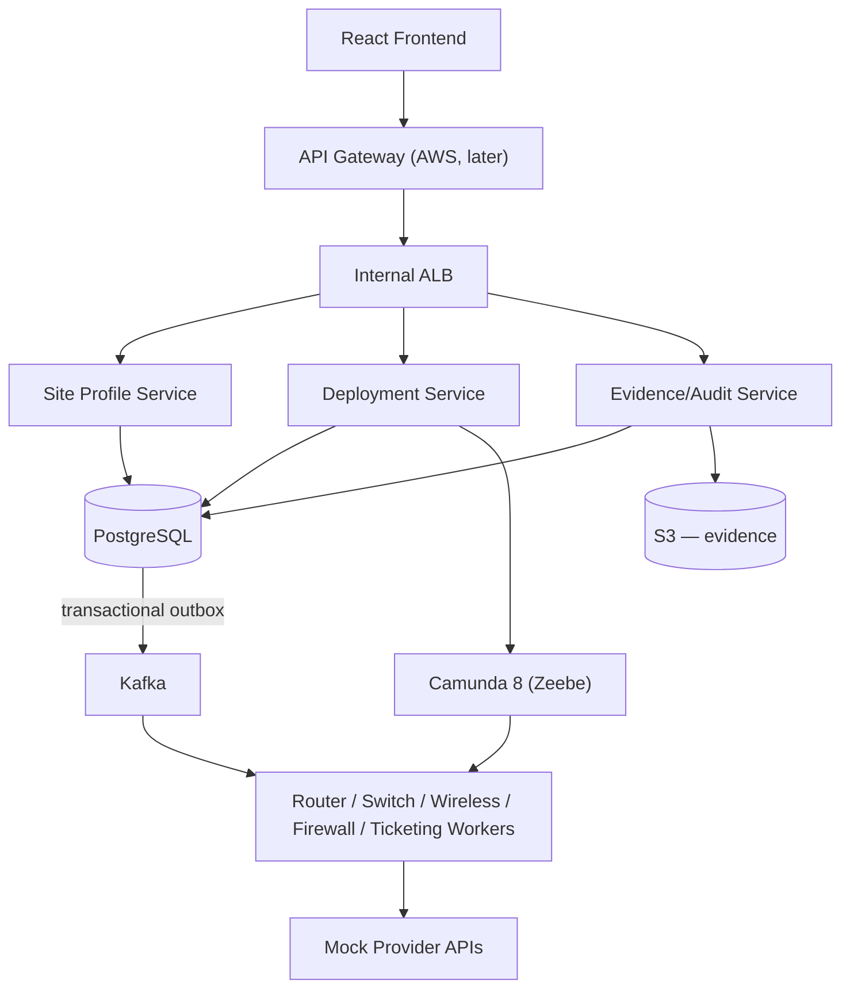

# ENSAP — Enterprise Network Site Automation Platform

> **Personal learning / portfolio project.** A redesigned learning
> implementation — not a production system at any employer. All external
> network/provider/source systems are synthetic and mocked; no real
> vendor credentials, APIs, or infrastructure IDs are used anywhere in
> this repository.

Cloud-native, event-driven learning project demonstrating distributed
workflow orchestration (Camunda 8), Kafka-based asynchronous processing,
resilient microservices, AWS infrastructure, Kubernetes, observability,
security, and (later) controlled agentic AI. Full spec:
`docs/01-prd.md` onward.

## Status: Phase 0 — Architecture & Scaffold (current)

Per the master spec's phased build plan (§37), this repository is
**scaffolding and documentation only** — no business logic is
implemented yet. See `docs/17-testing-strategy.md` for what's tested
today vs. planned, and each service's README for its own status.

| Component | Status |
|---|---|
| `docs/` (17 docs + 12 ADRs) | Done |
| C4 diagrams | `docs/04-c4-context.md`, `docs/05-c4-container.md` |
| Database model | `docs/09-database-design.md` + Liquibase changesets per service |
| API contracts | OpenAPI per service (`services/*/src/main/resources/openapi/`) |
| Event catalog | `docs/11-event-catalog.md` + `shared/event-contracts/asyncapi.yaml` |
| Camunda workflow design | `docs/08-workflow.md` + `workflow/camunda/deployment-process.bpmn` |
| Docker Compose skeleton | `infrastructure/docker/docker-compose.yml` (postgres/redis/kafka/zeebe/operate + 3 services live; mocks/workers/frontend commented, not built yet) |
| `site-profile-service`, `deployment-service`, `evidence-audit-service` | Spring Boot 3 / Java 21 / WebFlux **functional-endpoint** skeletons — build + 1 context-load smoke test each, all endpoints `501` stubs |
| `frontend` | React/TypeScript/Vite skeleton, 13 routes (master spec §5) rendering placeholders, builds + 1 test passes |
| `workers/*`, `mocks/*` | Directory + README placeholders only (Phase 4) |
| `infrastructure/{kubernetes,helm,terraform}` | Placeholders (Phase 9/10) |
| `.github/workflows/ci.yml` | Compile + unit test only (Phase 11 adds scan/build/deploy stages) |

## Architecture (target end-state)



Full diagrams: `docs/04-c4-context.md` (Level 1), `docs/05-c4-container.md`
(Level 2), `docs/06-component-design.md` (Level 3, per-service package
layout). Key decisions and tradeoffs: `docs/18-adr/`.

## Repository layout

```text
docs/            architecture docs (01-17) + ADRs (18-adr/)
frontend/        React + TypeScript + Vite operator console
services/        site-profile-service, deployment-service, evidence-audit-service
workers/         router/switch/wireless/firewall/ticketing (Phase 4)
mocks/           mock source/provider systems (Phase 4)
shared/          event-contracts (AsyncAPI), common-observability
workflow/camunda deployment-process.bpmn
infrastructure/  docker (live), kubernetes/helm (Phase 9), terraform (Phase 10)
.github/workflows ci.yml
```

## Build & run locally

No AWS credentials are required for any of this (master spec §2.3).

**Infrastructure** (PostgreSQL, Kafka, Redis, Camunda):

```bash
cd infrastructure/docker
docker compose up -d postgres redis kafka zeebe operate
```

**Each Java service** (Java 21 required; Maven wrapper needs no local
Maven install):

```bash
cd services/site-profile-service   # or deployment-service / evidence-audit-service
./mvnw -q verify        # build + run the Phase 0 smoke test
./mvnw spring-boot:run   # run against the infra above
```

> Windows note: if `./mvnw` fails with a `ClassNotFoundException` under
> Git Bash, run `mvnw.cmd` from PowerShell/cmd.exe instead with
> `JAVA_HOME` set to your JDK 21 install — this is a known Git-Bash/MSYS
> path-translation quirk with some Java launcher setups, not a problem
> with the wrapper itself (verified working both ways during Phase 0).

**Frontend:**

```bash
cd frontend
npm install
npm run dev     # or: npm run build && npm test
```

## Actual Phase 0 verification results

Run on 2026-09-06 (Java 21.0.10, Node 24.15.0, Maven wrapper 3.3.2 /
Maven 3.9.9, npm 11):

- `site-profile-service`: `./mvnw verify` → **BUILD SUCCESS**, 1/1 tests passed.
- `deployment-service`: `./mvnw verify` → **BUILD SUCCESS**, 1/1 tests passed.
- `evidence-audit-service`: `./mvnw verify` → **BUILD SUCCESS**, 1/1 tests passed.
- `frontend`: `npm run build` → **success** (tsc + vite build); `npm test` → **1/1 tests passed** (Vitest + React Testing Library).
- `docker-compose.yml` config not yet validated end-to-end (`docker compose up`) in this pass — infra images (postgres/redis/kafka/zeebe/operate) are standard published images referenced by tag, and the three service `build:` blocks point at the Dockerfiles verified above; full `docker compose up` is a reasonable next check but wasn't run as part of this Phase 0 pass.

No other numbers (performance, scale, coverage) are claimed anywhere in
this repository — see `docs/17-testing-strategy.md` and master spec §39.14.

## What's intentionally NOT implemented (Phase 0 boundary)

- Any business logic: site search/refresh, deployment creation/
  orchestration, evidence storage, audit recording — every API handler
  returns `501 Not Implemented`.
- Kafka producers/consumers, the transactional outbox publisher, and any
  Camunda job workers — the BPMN process and event contracts exist as
  design artifacts only.
- Workers and mock provider services — directories/READMEs only.
- Authentication/authorization (Cognito or local JWT) — no endpoint is
  protected yet.
- Redis caching — dependency wired into `site-profile-service` only,
  unused until Phase 1.
- Kubernetes/Helm/Terraform — placeholder READMEs only.
- Observability (OpenTelemetry/Prometheus/Grafana) beyond Actuator
  health endpoints.

This is the intended Phase 0 checkpoint (master spec §37, §40): the
repository builds, service skeletons start, documentation is coherent,
and the architecture can be reviewed — before any Phase 1 work begins.
