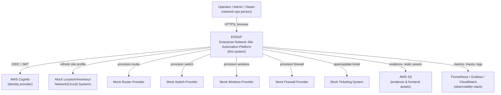

# 04 — C4 Context Diagram (Level 1)

Shows ENSAP as a single system and its external actors/systems. All
"external" systems here are mocked (see `22-mock-provider-ecosystem`
notes in the master spec §22) — nothing talks to a real vendor.

## Notes

- **Operator / Admin / Viewer** authenticate via Cognito (local dev uses
  a JWT-compatible stand-in, §6). Role determines what mutating actions
  are permitted; the backend enforces this, not the frontend.
- **Mock Location/Inventory/Network Systems** are the sources of truth
  ENSAP's Site Profile Service reconciles against — synthetic data only.
- **Mock Router/Switch/Wireless/Firewall Providers** and the **Mock
  Ticketing System** are called by the corresponding worker, never
  directly by the Deployment Service or Camunda (§8, §22).
- **S3** stores deployment evidence/config artifacts (Phase 2+) and,
  later, the built frontend (Phase 10).
- **Observability stack** is out of scope until Phase 8; shown here for
  the target end-state.
