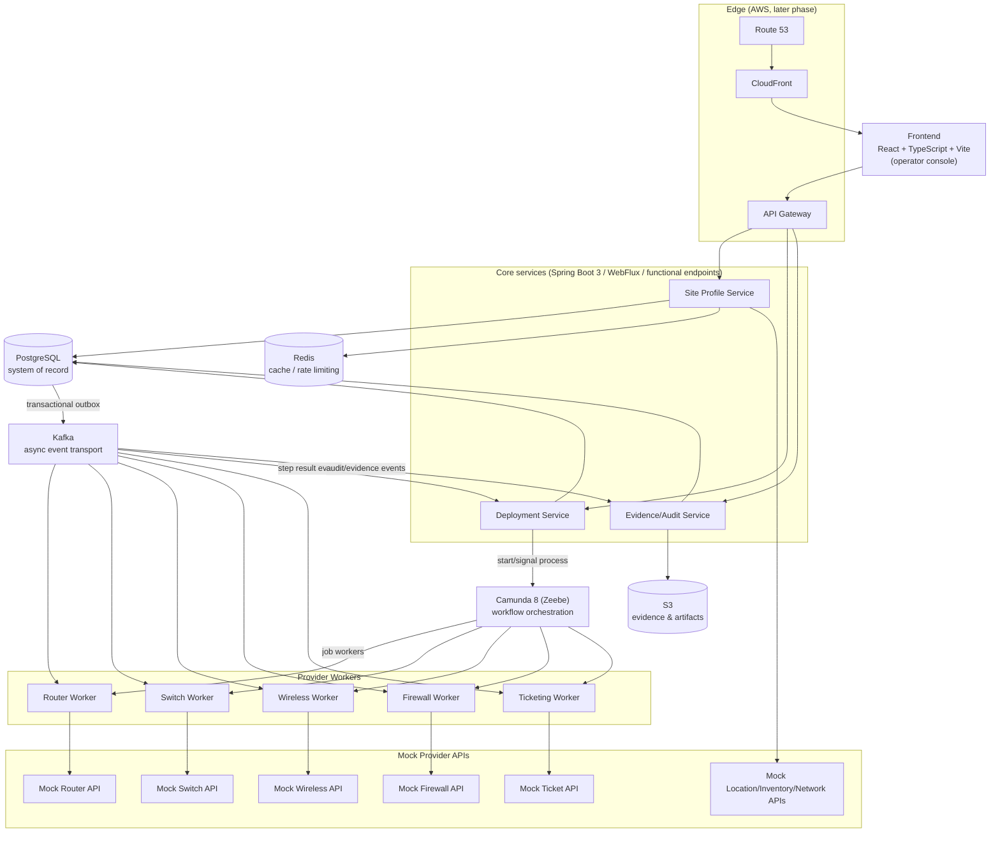

# 05 — C4 Container Diagram (Level 2)

Containers inside the ENSAP system boundary. Matches the "Final
Architectural Mental Model" in the master spec (§42) and the high-level
architecture in §4.1.

## Container responsibilities

| Container | Owns | Talks to |
|---|---|---|
| Frontend | UI only, no business rules | Core services via REST (through API Gateway in AWS) |
| Site Profile Service | site/device/network-profile/WAN/VLAN/subnet data | PostgreSQL, Redis, mock source systems |
| Deployment Service | deployment/batch/step lifecycle, idempotency keys | PostgreSQL, Camunda, outbox→Kafka |
| Evidence/Audit Service | evidence metadata, audit events | PostgreSQL, S3, Kafka (consumes result events) |
| Camunda 8 (Zeebe) | workflow instance state, retries, timers | Deployment Service (start/signal), job workers |
| Workers (5) | provider-specific execution | Kafka, mock provider APIs |
| PostgreSQL | system of record for all services (logical ownership per service, §13.2) | — |
| Redis | cache/rate-limit only, not durable state | Site Profile Service |
| Kafka | async event transport, not a system of record | producers/consumers above |
| S3 | evidence artifacts, later frontend assets | Evidence/Audit Service |

See `06-component-design.md` for the internal (Level 3) package layout
of each service.
