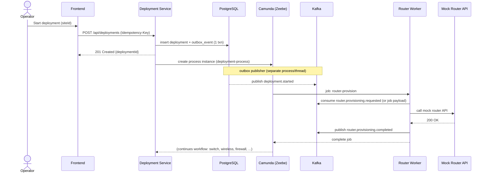
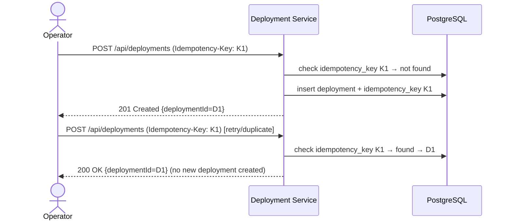
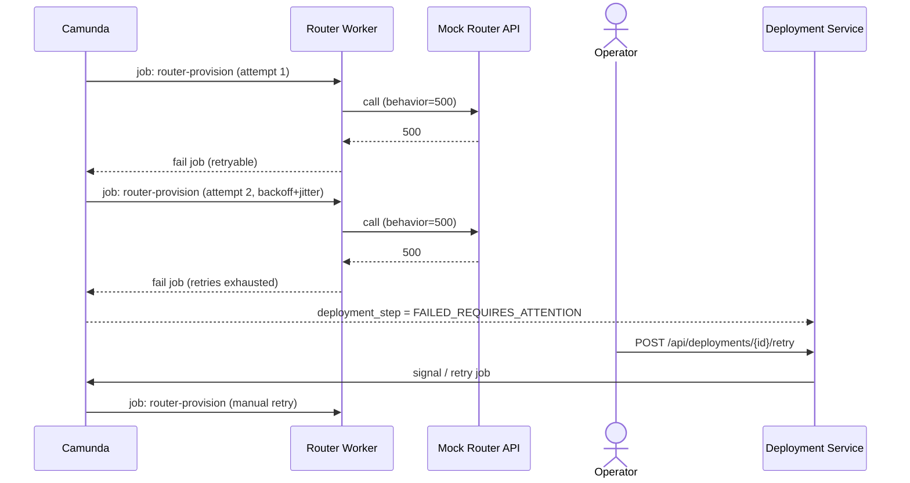
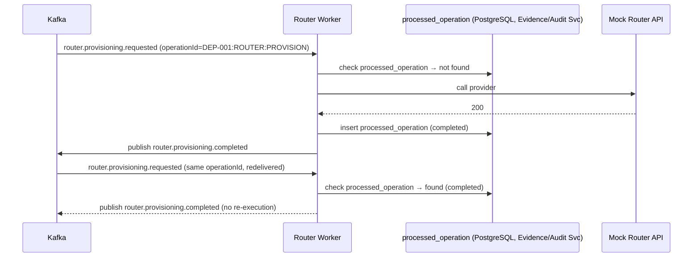

# 07 — Sequence Diagrams

These describe target behavior for later phases; nothing here is
implemented in Phase 0 (scaffolding only).

## Start a deployment (happy path, Phase 2–4)

## Duplicate request / idempotency (Phase 2)

## Provider failure → retry exhausted → manual recovery (Phase 5)

## Duplicate Kafka delivery, idempotent worker (Phase 3/4)

