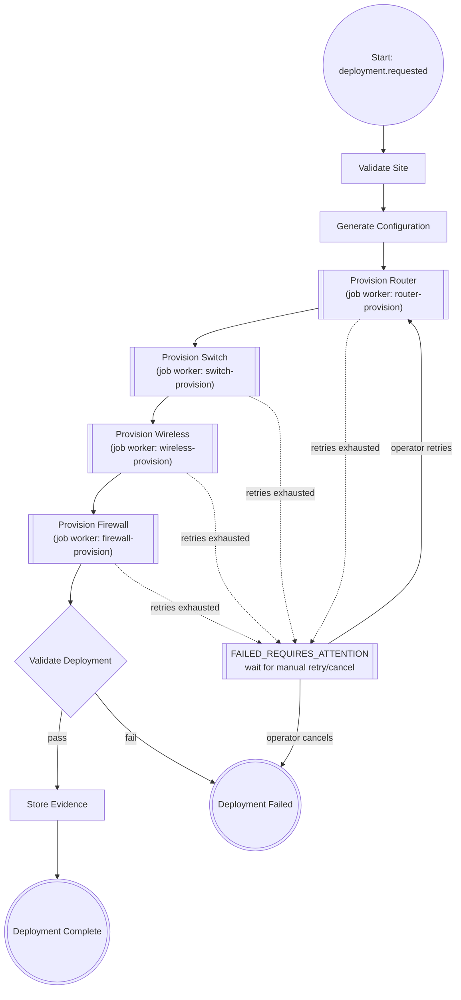

# 08 — Camunda 8 Workflow Design

## Why a workflow engine (§8)

A deployment is a long-running business process: multiple steps, across
multiple services/workers, with retries, timeouts, partial failures,
worker restarts, and manual intervention — state that must survive
process crashes. Camunda 8 (Zeebe) is the durable orchestrator that
tracks current step, completed steps, failures, timers, retries and
next actions. Workers only execute; **Camunda decides what happens
next** and contains no vendor-specific provisioning code.

- **Camunda** = workflow coordination (durable state machine)
- **Kafka** = asynchronous event transport between services/workers
- **Workers** = execution against mock provider APIs
- **PostgreSQL** = durable application state (deployment/step rows)
- **S3** = durable artifact storage (evidence)

This is **orchestration**, not choreography, for the deployment
lifecycle itself (one engine explicitly sequences the steps); Kafka
events remain the mechanism for decoupled side effects such as the
Evidence/Audit Service reacting to step-completed events (§34 —
orchestration vs. choreography).

## Process: `deployment-process`

BPMN source: `workflow/camunda/deployment-process.bpmn` (importable into
Camunda Modeler / deployable to a local Zeebe broker). Diagram:

Each `Provision <X>` step is a Zeebe **service task** with
`zeebe:taskDefinition type="<x>-provision"` and a bounded retry count +
backoff configured on the job; the corresponding worker
(`workers/<x>-worker`, Phase 4) is a Zeebe job worker that also
publishes the matching Kafka event (§9/§10) for other consumers
(Evidence/Audit Service, dashboards).

## Correlation

Every process instance is started with process variables `siteId`,
`deploymentId`, `correlationId`; these are copied onto every Kafka event
published during the process (§10, §24) so a single deployment can be
traced end-to-end across Camunda, Kafka, and worker logs.

## Manual intervention

`FAILED_REQUIRES_ATTENTION` is not a dead end — the Deployment Service's
`POST /api/deployments/{id}/retry` and `/cancel` endpoints
(`10-api-design.md`) signal the waiting process instance rather than
starting a new one, so workflow history/audit trail is preserved (§21).

## Phase 0 status

Only the BPMN diagram and this design doc exist. No Zeebe broker is
wired into a running service yet, and `deployment-process.bpmn` is not
auto-deployed by any service — that begins in Phase 2. The Docker
Compose skeleton (`infrastructure/docker/docker-compose.yml`) already
starts a local Zeebe broker + Operate so the process can be deployed and
inspected manually.
