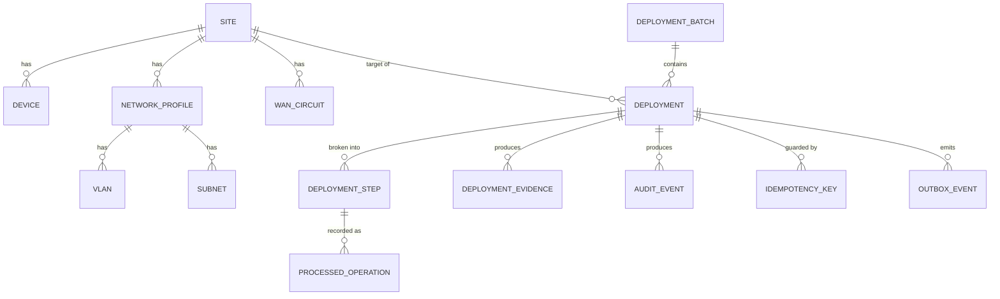

# 09 — Database Design

## Local vs. AWS

Local: PostgreSQL (via Docker Compose). AWS (Phase 10): Aurora
PostgreSQL. Same schema, same JPA/Hibernate/Liquibase code — only the
connection endpoint changes.

## Ownership (§13.2)

One physical PostgreSQL instance is used locally for simplicity, but
tables are **logically owned per service** — enforced by code review and
this document, not by physical database separation (yet). A service
must never write to a table it does not own; cross-service reads go
through the owning service's API or its published events.

| Service | Owns tables |
|---|---|
| Site Profile Service | `site`, `device`, `network_profile`, `wan_circuit`, `vlan`, `subnet` |
| Deployment Service | `deployment`, `deployment_batch`, `deployment_step`, `idempotency_key`, `outbox_event` |
| Evidence/Audit Service | `deployment_evidence`, `audit_event`, `processed_operation` |

## Entity-relationship overview



## Table sketches (Phase 0: Liquibase changesets create these tables;
no repository business logic uses them yet)

```text
site
  id (pk, e.g. SITE-001), name, region, status, source_system,
  last_refreshed_at, created_at, updated_at

device
  id (pk), site_id (fk -> site), type, vendor, model, serial_number,
  status, created_at

network_profile
  id (pk), site_id (fk -> site), profile_name, created_at

vlan
  id (pk), network_profile_id (fk), vlan_tag, name

subnet
  id (pk), network_profile_id (fk), cidr, purpose

wan_circuit
  id (pk), site_id (fk -> site), carrier, circuit_id, bandwidth_mbps

deployment
  id (pk, e.g. DEP-001), site_id, batch_id (fk, nullable), status,
  idempotency_key, requested_by, created_at, updated_at

deployment_batch
  id (pk), status, total_sites, created_at

deployment_step
  id (pk), deployment_id (fk), step_name (VALIDATE_SITE, GENERATE_CONFIG,
  PROVISION_ROUTER, PROVISION_SWITCH, PROVISION_WIRELESS,
  PROVISION_FIREWALL, VALIDATE_DEPLOYMENT, STORE_EVIDENCE), status,
  attempt_count, last_error, started_at, completed_at

idempotency_key
  key (pk), deployment_id (fk), created_at   -- unique constraint on key

outbox_event
  id (pk), aggregate_type, aggregate_id, event_type, event_version,
  payload (jsonb), correlation_id, trace_id, created_at, published_at
  (nullable -> not yet published)

deployment_evidence
  id (pk), deployment_id, step_name, s3_key, content_type, created_at

audit_event
  id (pk), deployment_id (nullable), site_id (nullable), actor,
  event_type, details (jsonb), created_at

processed_operation
  operation_id (pk, e.g. "DEP-001:ROUTER:PROVISION"), status,
  processed_at   -- unique constraint on operation_id enforces idempotency
```

## Liquibase

Each service owns its own changelog under
`services/<service>/src/main/resources/db/changelog/`, rooted at
`db.changelog-master.xml`, containing only the tables it owns (see
table above). Liquibase runs on service startup against the local
PostgreSQL instance. No seed/demo data is loaded in Phase 0.

## Migration strategy

Additive-first (new nullable columns, new tables) with a follow-up
changeset to tighten constraints once data is backfilled — standard
Liquibase practice, not automated yet since no schema evolution has
happened.
